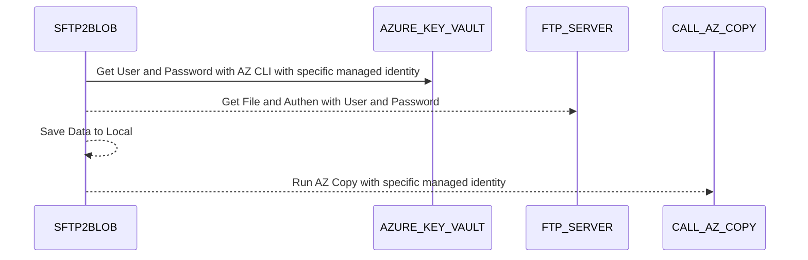
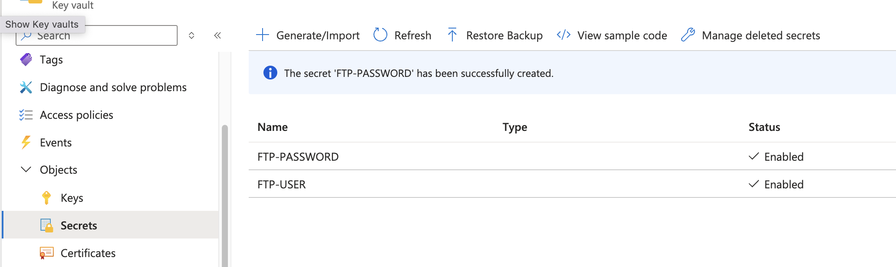
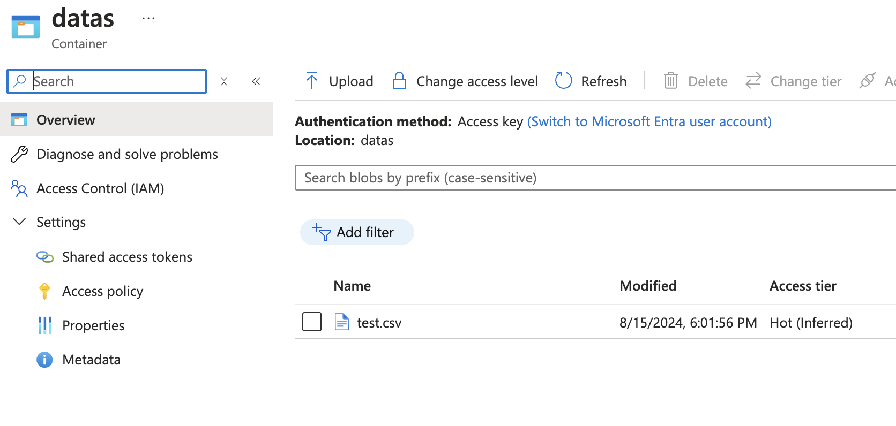

# SFTP2Blob - A simple shell script (Linux) to copy files from SFTP to Azure Blob Storage

This script is a simple shell script that copies files from SFTP or FTPs to Azure Blob Storage. 
It uses the `sftp` or `lftp` command to connect to the SFTP server and `azcopy` to copy files to Azure Blob Storage.

## Diagram


## Usage
```bash
./sftp2blob.sh --help
```
Example usage: Environment variables
```bash
export SFTP_HOST="new-host.example.com"
export SFTP_PORT="2222"
./sftp2blob.sh --protocol sftp
```

Example usage: Command line arguments
```bash
./sftp2blob.sh --protocol ftps --host new-host.example.com --port 2222 --remote /new/remote/path --local /new/local/path
````

## Configuration Environment Variables
The script uses the following environment variables to configure the SFTP/FTPs and Azure Blob Storage connection:

```bash
export SFTP_HOST="sftp.example.com"
export SFTP_PORT="22"
export REMOTE_FILE_PATH="/remote/path/to/your/file.txt"
export LOCAL_FILE_PATH="/local/path/to/downloaded/file.txt"

#Azure Configuration
export AZURE_STORAGE_ACCOUNT="your_storage_account_name"
export AZURE_CONTAINER_NAME="your_container_name"
export AZURE_BLOB_NAME="your_blob_name"

#Azure Configuration - Azure Key Vault
export KEY_VAULT_NAME="your-key-vault-name"
export SFTP_USERNAME_SECRET_NAME="sftp-username-secret"
export SFTP_PASSWORD_SECRET_NAME="sftp-password-secret"

#Azure Configuration - Specific Managed Identity 
export MANAGED_IDENTITY_CLIENT_ID="your-managed-identity-client-id"
```

## Prerequisites
- [Azure CLI](https://docs.microsoft.com/en-us/cli/azure/install-azure-cli)
- [AzCopy](https://docs.microsoft.com/en-us/azure/storage/common/storage-use-azcopy-v10)
- [lftp](https://lftp.yar.ru/)
- [sftp](https://linuxize.com/post/how-to-use-linux-sftp-command-to-transfer-files/)
- [jq](https://stedolan.github.io/jq/)
- Azure Blob Storage account
- Azure Key Vault (store the SFTP/FTPs user/password)


## Azure CLI (Add extensions)
For this script will add all available extensions to the Azure CLI.
```bash
for extension in $(az extension list-available --query "[].name" -o tsv); do
  az extension add --name $extension
done
```
Or you can add the specific extensions: (ex. key vault)
```bash
az extension add --name keyvault
````


## Example for run shell script
This example uses the `ftp` protocol to connect to the FTP server (localhost) and copy the file `test.csv` to the Azure Blob Storage account `nickdevstorage003` and container `datas` with the blob name `test.csv`. The script uses the Azure Key Vault `nickkvdev001` to store the FTP username and password.
```bash
./sftp2blob.sh --protocol ftp \
    --host localhost \
    --port 22 \
    --remote /upload/test.csv \
    --local test.csv \
    --storage-account nickdevstorage003 \
    --container datas \
    --blob test.csv \
    --vault nickkvdev001 \
    --username-secret FTP-USER \
    --password-secret FTP-PASSWORD \
    --identity <<client-id>> of managed identity
```
Example output after running the script:
```chatinput
Downloading file from FTP...
ftpuser001
password
Debug Information:
  PROTOCOL: ftp
  SFTP_HOST: localhost
  SFTP_PORT: 22
  REMOTE_FILE_PATH: /upload/test.csv
  LOCAL_FILE_PATH: test.csv
  AZURE_STORAGE_ACCOUNT: nickdevstorage003
  AZURE_CONTAINER_NAME: datas
  AZURE_BLOB_NAME: test.csv
  KEY_VAULT_NAME: nickkvdev001
  SFTP_USERNAME_SECRET_NAME: FTP-USER
  SFTP_PASSWORD_SECRET_NAME: FTP-PASSWORD
  MANAGED_IDENTITY_CLIENT_ID: <<client-id>> of managed identity
  SFTP_USER: ftpuser001
  SFTP_PASSWORD: (hidden for security)

15 bytes transferred
Uploading file to Azure Blob Storage...
WARN: The flags --service-principal and --identity will be deprecated in a future release. Please use --login-type=SPN or --login-type=MSI instead.
INFO: Login with identity succeeded.
INFO: Scanning...
INFO: Autologin not specified.
INFO: Authenticating to destination using Azure AD
INFO: Any empty folders will not be processed, because source and/or destination doesn't have full folder support

Job 51905158-2547-7444-4945-786560fc9e54 has started
Log file is located at: /home/azureuser/.azcopy/51905158-2547-7444-4945-786560fc9e54.log

100.0 %, 1 Done, 0 Failed, 0 Pending, 0 Skipped, 1 Total, 2-sec Throughput (Mb/s): 0.0001


Job 51905158-2547-7444-4945-786560fc9e54 summary
Elapsed Time (Minutes): 0.0334
Number of File Transfers: 1
Number of Folder Property Transfers: 0
Number of Symlink Transfers: 0
Total Number of Transfers: 1
Number of File Transfers Completed: 1
Number of Folder Transfers Completed: 0
Number of File Transfers Failed: 0
Number of Folder Transfers Failed: 0
Number of File Transfers Skipped: 0
Number of Folder Transfers Skipped: 0
Total Number of Bytes Transferred: 15
Final Job Status: Completed

INFO: Logout succeeded.
File transfer completed successfully.

```
## From Azure Portal
Key Vault - Secrets


Azure Blob Storage - Containers (Output after run script)

